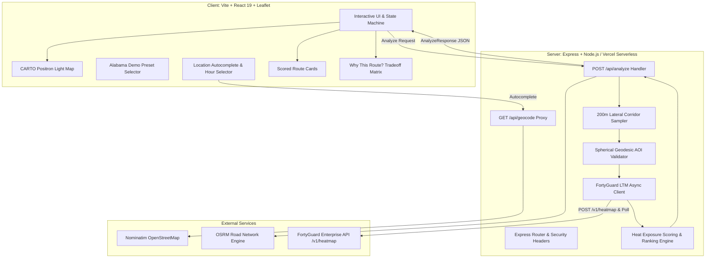
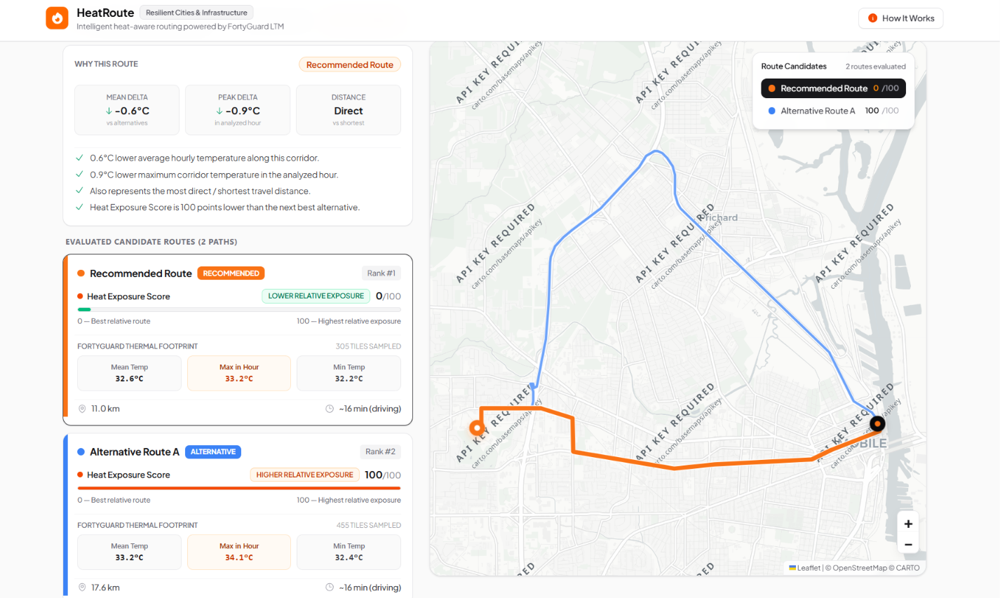
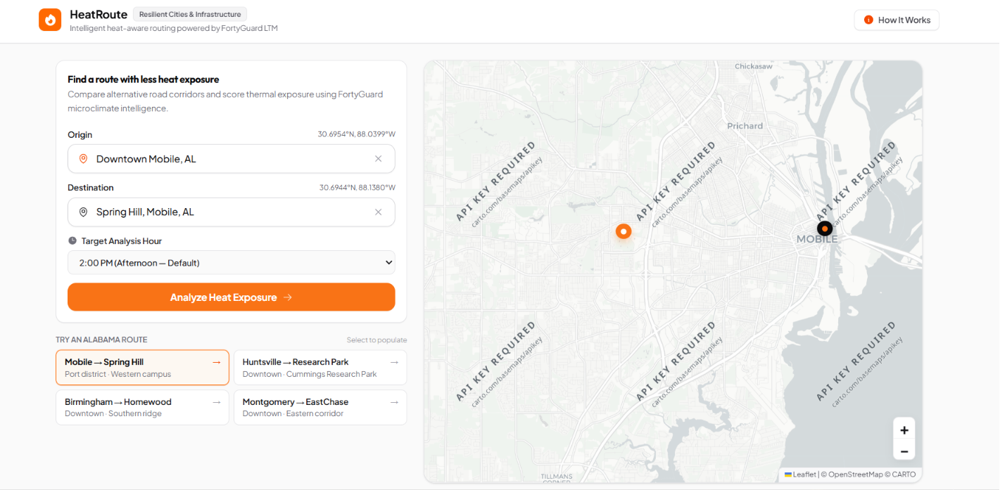
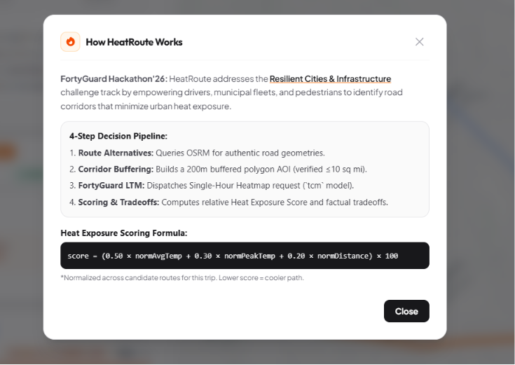

# HeatRoute

> **Heat-aware route decision engine powered by FortyGuard.**

[](#)
[](#)
[](#)
[](#)
[](#)
[](#)
[](#)

---

## Live Demo & Deployment

🚀 **Frontend (Vercel):** Connect your GitHub repository to Vercel (Root Directory: `heatroute`, set `VITE_API_URL=https://your-backend.onrender.com`).  
⚡ **Backend API (Render):** Deployed on a persistent Node.js Web Service (e.g., `https://heatroute-api.onrender.com`).

---

## What is HeatRoute?

**HeatRoute** is an urban mobility decision engine that routes commuters, pedestrians, and cyclists around extreme urban heat. Instead of optimizing strictly for minimum travel distance or fastest transit time, HeatRoute evaluates candidate road routes against **hyperlocal spatial temperature intelligence** generated by **FortyGuard's Large Temperature Models (LTMs)**.

The system calculates a deterministic, comparative **Heat Exposure Score (0–100)** for candidate routes, balancing average corridor temperature, peak heat in the analyzed hour, and distance tradeoffs to deliver an evidence-backed, explainable route recommendation.

---

## Hackathon Context

* **Competition**: **FortyGuard Hackathon'26**
* **Primary Track**: **Resilient Cities & Infrastructure**
* **Track Alignment**: Track 1 specifically challenges developers to build *"AI applications and agents that route people around heat."*
* **Why HeatRoute Fits**: HeatRoute uses FortyGuard's AI/LTM-powered temperature intelligence to compare real road corridors and support heat-aware route decisions. Rather than treating microclimate data as a passive static heatmap, HeatRoute dynamically queries FortyGuard along physical road corridors to compute heat differentials that help citizens avoid urban heat sinks.

---

## The Problem

Traditional navigation engines (Google Maps, Apple Maps, OSRM) treat the urban environment as thermally uniform. In cities experiencing severe **Urban Heat Island (UHI)** effects, the shortest physical distance frequently routes travelers through unshaded asphalt corridors, concrete canyons, and industrial heat sinks where surface temperatures can exceed shaded parkways by 5°C to 12°C.

---

## The Solution

HeatRoute bridges navigation engines with climate tech through a closed pipeline:

```text
User Origin & Destination
        ↓
Real Road Alternative Candidates (OSRM)
        ↓
Lateral Corridor Polygons (200m Buffer)
        ↓
FortyGuard LTM Single-Hour Heatmap API (TCM 100m)
        ↓
Extracted FortyGuard Temperature Data (Mean, Maximum in analyzed hour, Minimum in °C)
        ↓
Mathematical Heat Exposure Scoring (0–100)
        ↓
Factual "Why This Route?" Tradeoff Recommendation
```

---

## How It Works (Step-by-Step)

1. **Geocoding**: The user enters an origin and destination (or chooses an Alabama preset). Nominatim resolves the locations with caching and strict United States geographic filtering.
2. **OSRM Route Generation**: HeatRoute queries the open road network to discover legitimate candidate driving/cycling routes.
3. **Route Sampling & Corridor Creation**: For each candidate route, 6 representative waypoints are extracted and buffered laterally by $200\text{m}$ to construct a closed GeoJSON corridor polygon ring.
4. **AOI Geodesic Area Validation**: The polygon surface area is calculated using spherical excess trigonometry to ensure it complies with HeatRoute's configured area limits. HeatRoute currently uses a conservative 10 sq mi AOI limit for this project configuration; the applicable FortyGuard plan limit may differ by account.
5. **FortyGuard Heatmap Submission**: HeatRoute submits the corridor polygon to FortyGuard (`POST /v1/heatmap`) with `analytic_type: "tcm"`, `granularity: 100`, `filter_type: 1`, and the selected target hour.
6. **Async Bounded Polling (Takes ~25 to 40 seconds)**: The backend polls `GET /v1/status/<ACTIVITY_ID>` every 3 seconds until FortyGuard finishes generating the high-resolution thermal raster tiles (status transitions from `Processing` to `Completed`). **Note:** Generating and retrieving thermal microclimate data for candidate route corridors takes approximately **25 to 40 seconds** across the asynchronous pipeline.
7. **Thermal Extraction**: The parser normalizes `stats_data.Temperature_stats`, extracting FortyGuard LTM temperature intelligence (`Mean`, `Maximum in analyzed hour`, and `Minimum` temperatures in °C).
8. **Scoring & Ranking**: When multiple routes exist, candidates are normalized across temperature and distance dimensions to compute the Heat Exposure Score.
9. **Factual Recommendation**: The winner is surfaced with explicit delta metrics (e.g., 0.1°C lower mean temperature, 0.4°C lower maximum temperature in the analyzed hour , 6.6 km shorter"*).


---

## System Architecture



---

## Tech Stack

| Technology | Actual Version | Purpose |
|---|---|---|
| **Vite** | `8.2.2` | Frontend build tool and development server |
| **React** | `19.2.8` | Component architecture and state management |
| **TypeScript** | `6.0.2` | Strict end-to-end type safety |
| **TailwindCSS** | `4.3.3` | Modern, responsive styling system |
| **Express** | `5.2.1` | Backend API server and Vercel serverless handler |
| **Leaflet** | `1.9.4` | Interactive mapping and route polyline rendering |
| **Zod** | `4.5.4` | Schema validation and input sanitation |
| **Vitest** | `4.1.11` | Automated unit and integration test runner |
| **OSRM** | *REST API* | Open road network routing and waypoint generation |
| **Nominatim** | *REST API* | Location geocoding with US boundary constraints |
| **FortyGuard** | *REST API v1* | LTM Single-Hour Heatmap thermal intelligence |

---

## FortyGuard API Integration

FortyGuard LTM integration is the core foundation of HeatRoute's thermal intelligence:

### 1. Task Submission (`POST /v1/heatmap`)
```http
POST https://api.fortyguard.com/v1/heatmap
api-key: YOUR_FORTYGUARD_API_KEY
Content-Type: application/json
Accept: application/json
```
```json
{
  "polygon_aoi": {
    "type": "Polygon",
    "coordinates": [
      [
        [-88.0418, 30.6972],
        [-88.0645, 30.6985],
        [-88.0982, 30.7011],
        [-88.1362, 30.6960],
        [-88.1398, 30.6928],
        [-88.1362, 30.6896],
        [-88.0982, 30.6947],
        [-88.0645, 30.6921],
        [-88.0418, 30.6908],
        [-88.0380, 30.6940],
        [-88.0418, 30.6972]
      ]
    ]
  },
  "date_time": {
    "start_date": "2026-08-30",
    "start_time": "14:00",
    "filter_type": 1
  },
  "granularity": 100,
  "analytic_type": "tcm"
}
```

### 2. Initial Submission Response
```json
{
  "error": false,
  "status_code": 200,
  "message": "Heatmap request submitted successfully.",
  "data": {
    "activity_id": "<REDACTED_ACTIVITY_ID>",
    "status": "Processing"
  }
}
```

### 3. Asynchronous Polling & Extraction (`GET /v1/status/<ACTIVITY_ID>`)
The client polls the status endpoint until completion:
```json
{
  "error": false,
  "status_code": 200,
  "message": "Heatmap data retrieved successfully.",
  "data": {
    "activity_id": "<REDACTED_ACTIVITY_ID>",
    "status": "Completed",
    "stats_data": {
      "Temperature_stats": {
        "Mean": 33.40,
        "Maximum": 33.89,
        "Minimum": 33.12,
        "Median": 33.38,
        "StdDev": 0.18
      }
    }
  }
}
```

---

## Scoring Method

For multi-route comparisons ($N \ge 2$), raw metrics across candidate routes are min-max normalized:

$$\text{normAvg}_i = \frac{\bar{T}_i - \min(\bar{T})}{\max(\bar{T}) - \min(\bar{T})}$$

$$\text{normPeak}_i = \frac{T_{\text{max}, i} - \min(T_{\text{max}})}{\max(T_{\text{max}}) - \min(T_{\text{max}})}$$

$$\text{normDist}_i = \frac{D_i - \min(D)}{\max(D) - \min(D)}$$

$$\text{RawScore}_i = 0.50 \cdot \text{normAvg}_i + 0.30 \cdot \text{normPeak}_i + 0.20 \cdot \text{normDist}_i$$

$$\text{Heat Exposure Score}_i = \text{round}(\text{RawScore}_i \cdot 100)$$

> **Important Clarification**: The Heat Exposure Score is a **HeatRoute comparative decision metric** calculated to evaluate relative corridor exposure among the candidate routes for a specific trip. It is **not** an absolute medical rating, occupational safety standard, or certified health threshold.

---

## Single-Route vs Multi-Route Behavior

### Single-Route Handling
* When the road network provides only 1 route:
  * `heatScore = null`
  * `comparisonAvailable = false`
  * UI shows: **`ONLY ROUTE AVAILABLE`**
  * Displays authentic FortyGuard thermal stats (`Mean`, `Max in hour`, `Min`).
  * Comparative score badges, false rank numbers, and artificial percentage scores are strictly disabled.

### Multi-Route Handling (2–3 Routes)
* Evaluates all candidates through FortyGuard LTM.
* Normalizes metrics and assigns scores ($0 \text{ to } 100$).
* Ranks routes ascending (Score 0 = Winner / Recommended).
* Highlights factual tradeoffs in the decision panel.

---

## "Why This Route?" Factual Rationale

The recommendation card surfaces purely factual differentials:
* **Mean Temperature Delta**: e.g., `-0.1°C Mean` cooler than alternatives.
* **Maximum Temperature in the Analyzed Hour Delta**: e.g., `-0.4°C Max in hour` lower peak exposure.
* **Distance Difference**: e.g., `6.6 km shorter` or `1.2 km longer`.
* **Score Advantage**: Comparative points advantage over alternative candidates.

---

## Route Colors

| Identifier | Hex Color | Role |
|---|:---:|---|
| **Route 1 / Winner** | `#F97316` | **Recommended Route** (Warm Orange Accent) |
| **Route 2** | `#3B82F6` | **Alternative A** (Calm Blue) |
| **Route 3** | `#A78BFA` | **Alternative B** (Light Violet) |

---

## Geographic & Temporal Scope

* **Documented FortyGuard Scope**: United States.
* **Project & Demo Focus**: Alabama (Mobile, Birmingham, Huntsville, Montgomery).
* **Boundary Enforcement**: Latitude $[24^\circ\text{N} \text{--} 50^\circ\text{N}]$, Longitude $[126^\circ\text{W} \text{--} 66^\circ\text{W}]$. Non-US coordinates are safely rejected with `422 Unprocessable Entity`.
* **Temporal Behavior**: Single-hour analysis at selected time (e.g., `08:00`, `10:00`, `12:00`, `14:00`, `16:00`, `18:00`). Reflects diurnal microclimate variations without assuming any universal peak hour.

---

## Security Architecture

```text
=============================================================================
SECURITY & INTEGRITY CONTROLS
=============================================================================
1. API Secret Isolation     : FORTYGUARD_API_KEY is stored strictly server-side.
2. Zero Bundle Leakage      : Key is never prefixed with VITE_ and excluded from dist/.
3. SSRF Protection          : Outbound requests hardcoded to trusted APIs only.
4. Input Sanitation         : Zod schemas validate all coordinates, dates, and queries.
5. Hard Request Budgets     : MAX_FORTYGUARD_REQUESTS_PER_ANALYSIS = 40.
6. Error Masking            : Internal error traces masked from client responses.
=============================================================================
```

---

## Environment Variables

Configure these variables in your `.env` file or Vercel dashboard:

```bash
# Required: FortyGuard API Key
FORTYGUARD_API_KEY=

# Optional Server Settings
PORT=3001
CORS_ORIGIN=http://localhost:5173
FORTYGUARD_MAX_AOI_AREA_MI2=10
```

> **Security:** Never commit `.env` or expose the FortyGuard API key in frontend code. Use environment variables only.

---

## Local Setup & Run Commands

```bash
# 1. Clone the repository
git clone https://github.com/amir-elsamahy/HeatRoute-FortyGuardhackathon.git
cd HeatRoute-FortyGuardhackathon/heatroute

# 2. Install dependencies
npm install

# 3. Setup environment variables
cp .env.example .env
# Edit .env and set FORTYGUARD_API_KEY=your_actual_key_here
```

> **Security:** Never commit `.env` or expose the FortyGuard API key in frontend code. Use environment variables only.

```bash
# 4. Start full dev environment (Concurrent Express backend :3001 + Vite frontend :5173)
npm run dev
```

### Available Scripts (`package.json`)

| Script | Command | Description |
|---|---|---|
| `dev` | `npm run dev` | Runs backend server and Vite client concurrently |
| `test` | `npm test` | Runs Vitest automated test suite |
| `typecheck` | `npm run typecheck` | Runs TypeScript compiler validation (`tsc --noEmit`) |
| `build` | `npm run build` | Runs TypeScript check + Vite production bundle build |
| `preview` | `npm run preview` | Previews local production build |

---

## Testing & Quality Assurance

### Automated Vitest Suite (37 Tests Passed)
* `tests/fortyguard/contract.test.ts` (7 tests): FortyGuard API task lifecycle, schema validation, polling states.
* `tests/fortyguard/parser.test.ts` (3 tests): Multi-casing parsing, missing value handling, feature fallbacks.
* `tests/routing/area.test.ts` (4 tests): Spherical excess geodesic area calculations and boundary checks.
* `tests/routing/sampling.test.ts` (3 tests): 200m lateral corridor polygon construction and GeoJSON validity.
* `tests/scoring/heatScore.test.ts` (7 tests): Min-max normalization math, division-by-zero guards, determinism.
* `tests/scoring/ranking.test.ts` (2 tests): Route sorting, tradeoff differentials, rationale text generation.
* `tests/validation/schemas.test.ts` (7 tests): Zod coordinate schemas, US bounds prefilters, negative query rejection.
* `tests/api/serverlessEntrypoint.test.ts` (4 tests): Serverless endpoints, payload validation, and CORS.

### TestSprite End-to-End Validation
* **TC001 (Geocoding Endpoint)**: Valid and invalid location queries and suggestions.
* **TC002 (Analyze Endpoint)**: Multi-route evaluation, foreign coordinate rejection (`422`), non-numeric parameter handling.
* **TC003 (Health Endpoint)**: Service availability and configuration diagnostics (`GET /api/health`).

---

## Production Deployment

HeatRoute uses a modern, resilient full-stack deployment:

### 1. Backend API on Render (Persistent Server)
* **Platform**: [Render.com](https://render.com) (Free Web Service)
* **Root Directory**: `heatroute`
* **Runtime**: `Node`
* **Build Command**: `npm install`
* **Start Command**: `npm run start`
* **Environment Variable**: `FORTYGUARD_API_KEY=your_key`
* **Advantage**: Persistent process supports the 25–40 second FortyGuard asynchronous polling without serverless function timeout limits.

### 2. Frontend Client on Vercel (Edge CDN)
* **Platform**: [Vercel.com](https://vercel.com) (Vite SPA)
* **Root Directory**: `heatroute`
* **Build Command**: `npm run build`
* **Output Directory**: `dist`
* **Environment Variable**: `VITE_API_URL=https://heatroute-api.onrender.com`

---

## Known Limitations & Performance

1. **Upstream FortyGuard Async Latency**: Calling the FortyGuard thermal analysis API along route corridors takes approximately **25 to 40 seconds** to generate 100m TCM raster tiles and complete status polling. The frontend UI provides an animated progressive step tracker while the asynchronous analysis completes.
2. **Physical Road Network Dependencies**: In corridors with only one highway, OSRM legitimately returns 1 route; HeatRoute treats these as single routes rather than generating unrealistic artificial detours.
3. **Public OSRM & Nominatim Demo Servers**: Subject to public server rate limits; enterprise setups should use dedicated instances.
4. **Oversized Corridors**: Corridors exceeding HeatRoute's configured AOI limit are rejected. The current project configuration uses a conservative 10 sq mi limit; the applicable FortyGuard plan limit may differ by account.
5. **Single-Hour Snapshot**: Analyzes a specific selected hour rather than dynamic multi-hour shifts across long-haul journeys.
6. **Comparative Metric**: The Heat Exposure Score is a relative decision metric for evaluating route candidates for a specific trip, not an absolute health metric.

---

## Interactive Demo Flow

1. Select the **"Mobile: Downtown → Spring Hill"** preset (or type custom Alabama locations).
2. Select target time (e.g., **2:00 PM Afternoon**).
3. Click **"Analyze Cool Routes"**.
4. Observe the progressive technical status tracker (takes ~25 to 40 seconds for thermal computation).
5. Inspect the interactive map with colored route polylines and contrast casing.
6. Compare FortyGuard temperature statistics (`Mean`, `Max in hour`, `Min`) and review the **"Why This Route?"** decision summary.

---

## Visual Tour & Screenshots

### 1. Multi-Route Evaluation & Thermal Footprint


### 2. Route Tradeoffs & Detailed Temperature Statistics


### 3. How HeatRoute Works — 4-Step Decision Pipeline


---

## Project Structure

```text
HeatRoute-FortyGuardhackathon/
├── .gitignore                     # Root gitignore protecting .env and build artifacts
├── LICENSE                        # MIT License
├── README.md                      # Authoritative project technical documentation
└── heatroute/                     # Application source directory
    ├── api/                       # Vercel Serverless Function entrypoint
    │   └── index.ts               # Express adapter for Vercel
    ├── server/                    # Express Backend Service
    │   ├── app.ts                 # Express application definition
    │   ├── index.ts               # Local server runner (:3001)
    │   ├── config.ts              # Configuration & request limits
    │   ├── routes/                # API routes (/api/analyze, /api/geocode)
    │   └── services/
    │       ├── fortyguard/        # FortyGuard LTM client, parser, schemas, errors
    │       ├── routing/           # OSRM client, 200m corridor buffering, area math
    │       └── scoring/           # Heat exposure scoring formula & ranking
    ├── src/                       # Vite React 19 Frontend
    │   ├── App.tsx                # Main layout, state machine, route selection
    │   ├── components/
    │   │   ├── HeatScore/         # HeatScoreBadge (0-100 comparative exposure)
    │   │   ├── LocationSearch/    # PresetSelector & LocationInput
    │   │   ├── Map/               # RouteMap (Leaflet CARTO Light map)
    │   │   ├── RouteCard/         # RouteCard component
    │   │   ├── RouteComparison/   # WhyThisRoute tradeoff decision grid
    │   │   └── ui/                # LoadingSteps, ErrorBanner, TimeBadge
    │   ├── services/api.ts        # Typed client API service
    │   └── styles/index.css       # Design tokens & typography (Outfit & Plus Jakarta Sans)
    ├── tests/                     # Automated Vitest Test Suite (37 tests)
    ├── testsprite_tests/          # TestSprite PRD, test plans, and release reports
    ├── vercel.json                # Vercel deployment routing configuration
    ├── package.json               # Dependencies & scripts
    ├── tsconfig.json              # TypeScript strict configuration
    └── vite.config.ts             # Vite configuration & dev proxy
```

---

## Data Provenance: External vs Derived Intelligence

| Intelligence Dimension | Direct Source | Method / Processing |
|---|---|---|
| **Road Network Geometry** | **OSRM** | OpenStreetMap road network alternative extraction |
| **Location Geocoding** | **Nominatim** | Coordinate resolution with US boundary prefilters |
| **Corridor Polygon AOI** | **HeatRoute** | $200\text{m}$ lateral buffering of route waypoints |
| **Hyperlocal Temperatures** | **FortyGuard LTM** | Single-Hour TCM Heatmap (`stats_data.Temperature_stats`) |
| **Heat Exposure Score** | **HeatRoute** | Normalized multi-criteria formula ($0.50\bar{T} + 0.30T_{\text{max}} + 0.20D$) |
| **Tradeoff Differentials** | **HeatRoute** | Arithmetic delta comparison against competitor candidates |
| **Route Recommendation** | **HeatRoute** | Deterministic ranking (Rank #1 = Lowest Heat Exposure Score) |

---

## License

This project is licensed under the **MIT License**. See the [LICENSE](LICENSE) file for details.

---

## Acknowledgements

* **FortyGuard**: For pioneering Large Temperature Models (LTMs) and providing microclimate thermal API access.
* **OpenStreetMap & OSRM**: For open-source geospatial routing engines.
* **Nominatim**: For open geocoding infrastructure.
* **Leaflet & CARTO**: For interactive mapping and Positron tile layers.
